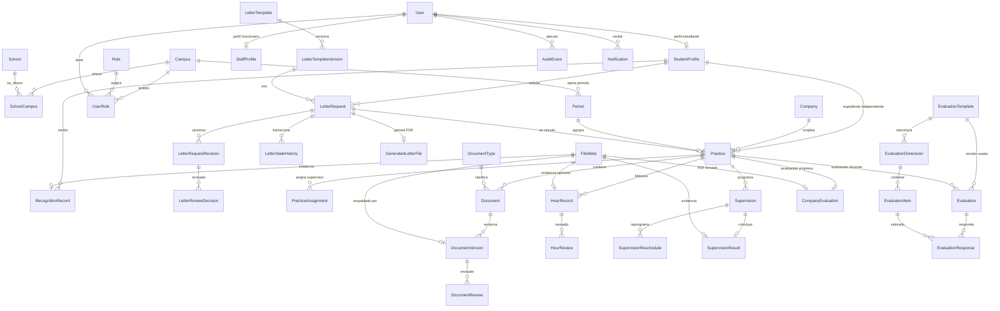

# 01 — Modelo de dominio

> Modelo conceptual del Sistema de PPP. Orienta el esquema Prisma y el diseño de servicios. No incluye implementación.

## 1. Principios de modelado

1. **Expediente = práctica.** No existe contenedor de prácticas; cada práctica es un expediente independiente (DEC-04).
2. **Acumulación por estudiante.** La agregación de horas y el cumplimiento son **derivados** (RN-06, HU-36); no se persisten cifras editables.
3. **Ámbito como dato estructural.** Toda entidad de negocio lleva `campusId` y `schoolId` resolubles; la autorización filtra siempre por ámbito (DEC-01, RN-10).
4. **Estados por acción.** Ninguna transición se produce mediante edición arbitraria de un campo `status`.
5. **Documento = agregado versionado.** Los aprobados son inmutables; cada corrección crea versión (RN-09).
6. **Catálogos configurables.** Meta de horas, plantillas, instrumentos, campus, escuelas y periodos son datos, no constantes (RNF-08).
7. **Archivos fuera de la base.** PostgreSQL guarda solo metadatos (hash, ruta interna, tamaño, MIME).

## 2. Entidades y atributos esenciales

### 2.1. Estructura institucional

| Entidad | Atributos clave | Notas |
|---|---|---|
| `Campus` | nombre, estado | Tres campus; catálogo administrado por `SYSTEM_ADMIN`. |
| `School` | nombre, codigo, estado | Ingeniería de Sistemas activa; otras escuelas `INACTIVA` (preparadas, no activadas). |
| `SchoolCampus` | schoolId, campusId, activo | Relación M:N; define dónde se ofrece cada escuela. |
| `Period` | campusId, nombre, fechaInicio, fechaFin, estado | Lo abre/cierra el coordinador del campus (HU-04). Cerrar impide nuevas prácticas; no altera historial. |
| `SystemParameter` | clave, valor, version, vigenteDesde, vigenteHasta | `PPP_HOURS_TARGET` (inicial 700), dominios de correo, límites de archivo, etc. Versionados. |

### 2.2. Identidad y personas

| Entidad | Atributos clave | Notas |
|---|---|---|
| `User` | correoInstitucional (único), nombreCompleto, estado, proveedorExternoId | Cuenta única por correo (HU-01). No dependiente de Lamb. |
| `Role` | codigo, descripcion, esAdministrativo | `SYSTEM_ADMIN`, `AUDITOR`, `COORDINATOR`, `SECRETARY`, `SUPERVISOR`, `STUDENT`. |
| `UserRole` | userId, roleId, campusId (nullable), estado, vigencia | Rol + ámbito. `SYSTEM_ADMIN` y `AUDITOR` sin campus obligatorio. Multi-rol permitido a nivel de modelo; en el MVP la asignación funcional es única. |
| `StudentProfile` | userId, codigo, documentoIdentidad, ciclo, campusId, schoolId, completo | Se completa en el primer acceso (HU-02). Cambios auditados. |
| `StaffProfile` | userId, campusId, activo | Para secretaría, coordinador y docente supervisor; oferta de docentes activos del campus (HU-20). |

### 2.3. Carta de presentación

| Entidad | Atributos clave | Notas |
|---|---|---|
| `LetterTemplate` / `LetterTemplateVersion` | campusId, schoolId, nombre, activo; templateId, version, contenido, vigente | Plantilla y versiones inmutables por campus/escuela (HU-06, TK-021). |
| `LetterRequest` | studentProfileId, campusId, schoolId, templateVersionId, destinatario, cargo, empresaObjetivo, areaPractica, datosPlantilla (JSON), estado, numero (nullable) | Estado: Borrador→Enviada→…→Aprobada/Anulada (ver 03). |
| `LetterRequestRevision` | letterRequestId, version, contenido (JSON) | Cada envío y reenvío conserva una revisión inmutable; la decisión queda ligada a la revisión revisada (HU-08). |
| `LetterReviewDecision` | letterRequestId, revisionId, reviewerId, decisión, comentario (nullable), fecha | Aprobar, observar o anular; observación y anulación exigen comentario. |
| `GeneratedLetterFile` | letterRequestId, revisionId, ruta privada, MIME, tamaño, hash, numero, generadoEn | PDF final generado por el sistema y descargable solo cuando la carta está aprobada (HU-07, HU-09). |
| `LetterStateHistory` | letterRequestId, estadoAnterior, estadoNuevo, actor, comentario, fecha | Historial inmutable de cada transición. |

La plantilla conserva sus recursos gráficos y textos institucionales estáticos (logo, firma, sello y pie). El sistema rellena los campos dinámicos del destinatario, empresa y área con la solicitud, y el nombre, código y ciclo con la instantánea del perfil del estudiante al enviar o reenviar.

### 2.4. Empresa y práctica

| Entidad | Atributos clave | Notas |
|---|---|---|
| `Company` | ruc (único, nullable), razonSocial, representante, cargo, direccion, contacto, area, esExtranjera | Reutilizable; búsqueda por RUC antes de crear (HU-10). Sin cuenta de usuario. |
| `Practice` (expediente) | studentProfileId, campusId, schoolId, periodId, companyId, areaCargo, responsableEmpresarial, fechaInicio, fechaFin, horario, modalidad, letterRequestId (nullable), estado | Núcleo del expediente. El estado gobierna las operaciones. |
| `PracticeAssignment` | practiceId, supervisorId (User), desde, hasta (nullable), motivo, activo | Historial de asignaciones; una vigente por práctica (HU-20). |
| `ImportBatch` | campusId, archivoId, usuario, resumenValidacion, estado | Staging de migración de prácticas activas (HU-45, DEC-07). |

### 2.5. Documentos del expediente

| Entidad | Atributos clave | Notas |
|---|---|---|
| `DocumentType` | codigo, etapa, obligatorio, condicional, soloLectura | `CARTA_ACEPTACION`, `CONVENIO`, `PLAN_TRABAJO`, `INFORME_FINAL`, `CONSTANCIA_CERTIFICADO`, `EVALUACION_EMPRESA`, `RECONOCIMIENTO`. |
| `Document` | practiceId, typeId, estadoVigente | Entidad documental por (práctica, tipo); agrega sus versiones. |
| `DocumentVersion` | documentId, version, archivoId, hash, mime, tamano, estado, validacionTecnica | Pendiente→En revisión→Observado→Aprobado/Anulado. Aprobada = inmutable. |
| `DocumentReview` | documentVersionId, actorId, decision, comentario, fecha | Aprobar/observar/anular; observar exige comentario (HU-16). |
| `FileMeta` | uuid interno, nombreOriginal, mime, tamano, hash, rutaPrivada, cargadoPor, cargadoEn | Todos los archivos del sistema; entregados solo con autorización temporal (RNF-03). |

### 2.6. Horas

| Entidad | Atributos clave | Notas |
|---|---|---|
| `HourRecord` | practiceId, fecha, descripcion, horas, evidenciaFileId (nullable), estado | Borrador→Enviado→Observado→Validado (HU-22). |
| `HourReview` | hourRecordId, actorId, decision, comentario, fecha | Validar u observar; observar exige comentario y habilita corrección (HU-23). |

Reglas de valor: `0 < horas <= 24`; fecha dentro del rango de la práctica (rechazo con advertencia si fuera, ver decisión A-04); sin valores negativos.

### 2.7. Supervisión

| Entidad | Atributos clave | Notas |
|---|---|---|
| `Supervision` | practiceId, tipo (`ENTRADA`/`INTERMEDIA`/`FINAL`), docenteId, fechaProgramada, estado | Máximo una activa del mismo tipo por práctica (HU-25). |
| `SupervisionReschedule` | supervisionId, nuevaFecha, motivo, anterior | Conserva la fecha anterior (HU-27). |
| `SupervisionResult` | supervisionId, fechaReal, modalidad, observaciones, acuerdos, evidenciaFileId (nullable), borrador | Solo el docente asignado completa; Finalizar → Realizada (HU-26). |

El vencimiento (`Vencida`) se deriva por fecha, no se edita.

### 2.8. Evaluaciones

| Entidad | Atributos clave | Notas |
|---|---|---|
| `EvaluationTemplate` | codigo, fase, version, activo, dimensiones/ítems | Instrumento versionado e inmutable en uso (HU-31). |
| `EvaluationDimension` / `EvaluationItem` | templateId, orden, descripcion, escala (1–5 o 0–20 o SÍ/NO/NA) | Datos configurables; sin diseñador visual (HU-31). |
| `Evaluation` | practiceId, fase, templateVersionId, docenteId, estado | Pendiente→En proceso→Finalizada→Reabierta. |
| `EvaluationResponse` | evaluationId, itemId, valor | `NA` se excluye del cálculo y no cuenta como cero (HU-28). |
| `CompanyEvaluation` | practiceId, empresa, supervisorEmpresarial, periodo, dias, horasDeclaradas, notaGeneral (0–20), archivoId, estado | PDF firmado externamente; Pendiente→En revisión→Observado→Aprobado (HU-29, DOC-02). |

No existe combinación automática entre escala docente y nota empresarial (HU-30).

### 2.9. Cierre y reconocimiento

| Entidad | Atributos clave | Notas |
|---|---|---|
| `ClosingChecklist` | — (consultable, no persistido como editable) | Resultado calculado por práctica: documentos de cierre aprobados, supervisiones y evaluaciones requeridas, comparación de horas (HU-34). |
| `RecognitionRecord` | studentProfileId, tipo, numero, fecha, archivoId, estado | Solo si el requisito PPP está `Cumplido`; al registrar, el estado general pasa a `Reconocido` (HU-37). Uno por estudiante. |

### 2.10. Plataforma

| Entidad | Atributos clave | Notas |
|---|---|---|
| `AuditEvent` | actorId, rol, campusId (nullable), accion, entidad, entidadId, resultado, detalle (JSON), fecha | Append-only, inmutable, no modificable desde la app (HU-44, ADR-006). |
| `Notification` | userId, tipo, mensaje, enlace, leida, fecha | Eventos internos únicos y respetando ámbito (HU-40). |

## 3. Agregados

| Agregado | Raíz | Contenido | Consistencia |
|---|---|---|---|
| **Expediente de práctica** | `Practice` | Empresa de referencia, asignaciones, documentos, horas, supervisiones, evaluaciones | La autorización y el cierre evalúan el agregado completo; los subelementos no se mutan en aislamiento para decisiones de frontera. |
| **Carta** | `LetterRequest` | Plantilla versionada, revisiones, decisiones, historial y archivo final | La aprobación genera el PDF final atómicamente (TK-026). |
| **Documento** | `Document` | Versiones + revisiones | Observar/reenviar crea versión; aprobar congela la versión vigente. |
| **Supervisión** | `Supervision` | Reprogramaciones + resultado | Programar/registrar conservan historia. |
| **Evaluación** | `Evaluation` | Plantilla versionada + respuestas | La finalización congela respuestas y versión del instrumento. |
| **Cumplimiento PPP** | `StudentProfile` (derivado) | Suma de horas validadas de prácticas finalizadas vs. meta vigente | Cálculo reproducible; el estado no se edita (HU-36, TK-142). |

## 4. Invariantes del dominio

### 4.1. Estructurales

- I-01: Toda práctica pertenece a un campus y escuela en los que la escuela está activa (`SchoolCampus.activo`).
- I-02: Una carta aprobada puede vincularse a una sola práctica; la práctica puede existir sin carta si se autoriza por la vía confirmada (campo `letterRequestId` nullable, "cuando corresponda", HU-11).
- I-03: Un `Company.ruc` es único cuando existe; `null` solo para empresas extranjeras.
- I-04: La asignación de supervisor es vigente-única por práctica (`PracticeAssignment.activo`); el historial no se borra.
- I-05: La meta de horas (700) y los límites técnicos se leen siempre de `SystemParameter` vigente; nunca de constantes.

### 4.2. Operativas

- I-06: Solo una práctica **Activa** admite envíos de horas; `Suspendida` los bloquea (HU-19).
- I-07: `0 < horas <= 24` por registro; la fecha debe estar dentro del rango de la práctica (A-04: rechazo con advertencia).
- I-08: Solo horas **Validadas** suman al avance; el **cumplimiento** considera solo horas validadas de prácticas **Finalizadas** (RN-06).
- I-09: Autorizar una práctica exige datos completos y documentos iniciales obligatorios **Aprobados** (HU-18).
- I-10: Máximo una supervisión activa del mismo tipo por práctica (HU-25).
- I-11: `NA` en ítems de evaluación se excluye del cálculo; no equivale a 0 (HU-28).
- I-12: El reconocimiento solo se registra si el requisito está `Cumplido`; su registro transita a `Reconocido` (HU-37).
- I-13: Todo documento observado conserva comentario y versiones; los aprobados no se sobrescriben ni eliminan físicamente (RN-09, RNF-04).
- I-14: Toda transición de estado exige motivo cuando el flujo lo define (observar, anular, suspender, cancelar, reasignar, reprogramar, reabrir).

### 4.3. De auditoría

- I-15: Las acciones críticas (aprobar, observar, anular, transiciones, reasignaciones, descargas sensibles) generan `AuditEvent` dentro de la misma transacción (RNF-04).
- I-16: `AuditEvent` y `DocumentVersion` aprobadas son inmutables; no existen operaciones de update/delete sobre ellos.
- I-17: El auditor no invoca ningún comando de escritura; la capa de autorización lo niega antes de llegar al servicio (RN-10, HU-43).

## 5. Diagrama ER (Mermaid)

## 6. Relaciones y cardinalidades esenciales

| Relación | Cardinalidad | Significado |
|---|---|---|
| Campus ↔ School | M:N (vía `SchoolCampus`) | Sistemas en tres campus; otras escuelas inactivas. |
| User ↔ Role | M:N (vía `UserRole`) | Rol + ámbito; multi-rol preparado. |
| StudentProfile ↔ Practice | 1:N | Varias prácticas (expedientes) por estudiante. |
| Practice ↔ Company | N:1 | Una empresa por práctica; empresa reutilizable. |
| Practice ↔ Period | N:1 | Práctica asociada a periodo sin perder fechas reales. |
| Practice ↔ LetterRequest | 1:0..1 | Carta aprobada vinculada "cuando corresponda". |
| LetterRequest ↔ LetterRequestRevision | 1:N | Cada envío conserva una instantánea inmutable. |
| LetterRequestRevision ↔ LetterReviewDecision | 1:N | Las decisiones quedan trazadas contra la revisión revisada. |
| Practice ↔ Document | 1:N | Un documento vigente por (práctica, tipo). |
| Document ↔ DocumentVersion | 1:N | Versionado incremental e inmutable. |
| Practice ↔ HourRecord | 1:N | Bitácora periódica. |
| Practice ↔ Supervision | 1:N | Tipos entrada/intermedia/final; uno activo por tipo. |
| Practice ↔ Evaluation | 1:N | Una por fase; versión de plantilla congelada. |
| Practice ↔ CompanyEvaluation | 1:0..1 | Una vigente; nueva versión si se observa. |
| StudentProfile ↔ RecognitionRecord | 1:0..1 | Documento individual por estudiante. |
| User ↔ AuditEvent | 1:N | Bitácora por actor. |

## 7. Campos derivados (nunca editables)

| Campo | Derivación |
|---|---|
| Total de horas de avance por práctica | Suma de `HourRecord` con estado `VALIDADO` de la práctica. |
| Total consolidado del estudiante | Suma de horas validadas de todas sus prácticas. |
| Cumplimiento PPP | Suma de horas validadas de prácticas `FINALIZADA` vs meta vigente (`SystemParameter.PPP_HOURS_TARGET` = 700). |
| Estado general del requisito | `PENDIENTE` < meta; `CUMPLIDO` ≥ meta; `RECONOCIDO` al registrar `RecognitionRecord`. |
| Checklist de cierre | Evaluado sobre documentos, supervisiones, evaluaciones y horas; sin persistencia editable. |
| Estado `Vencida` de supervisión | Fecha programada < hoy y estado Programada/Reprogramada. |
