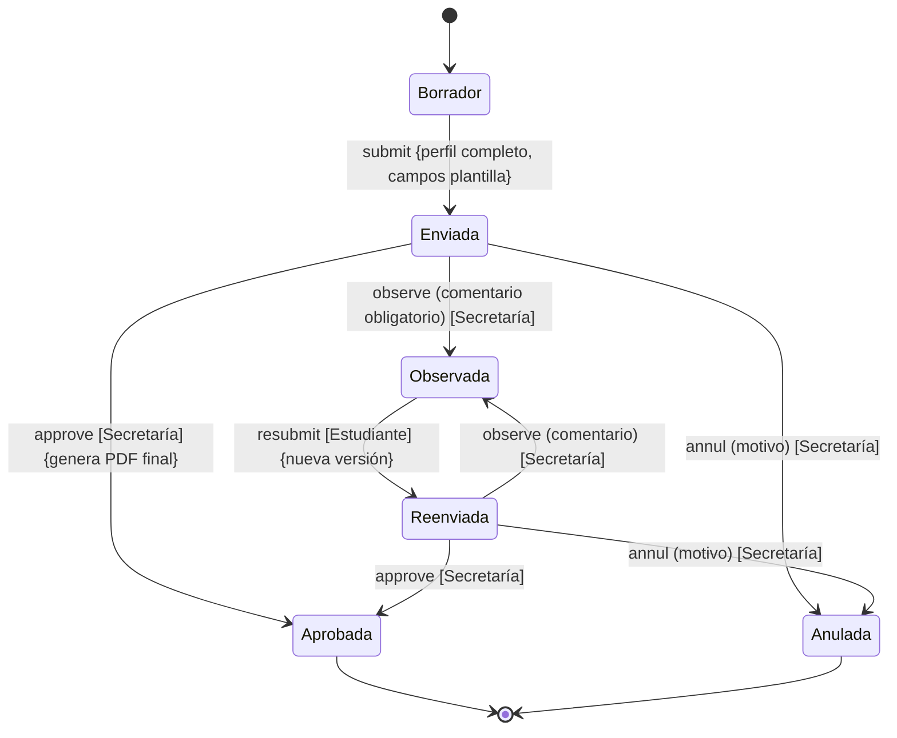
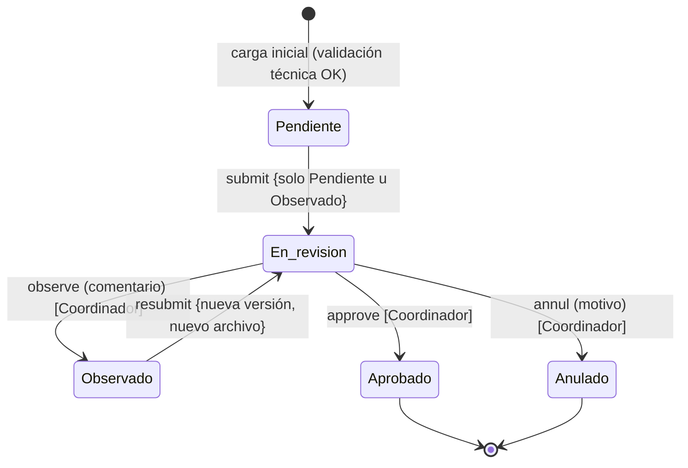
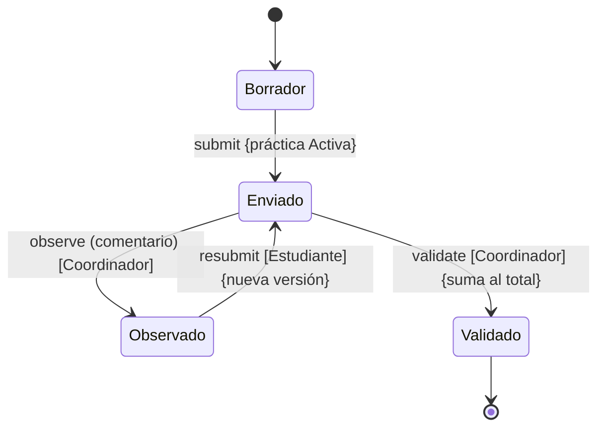
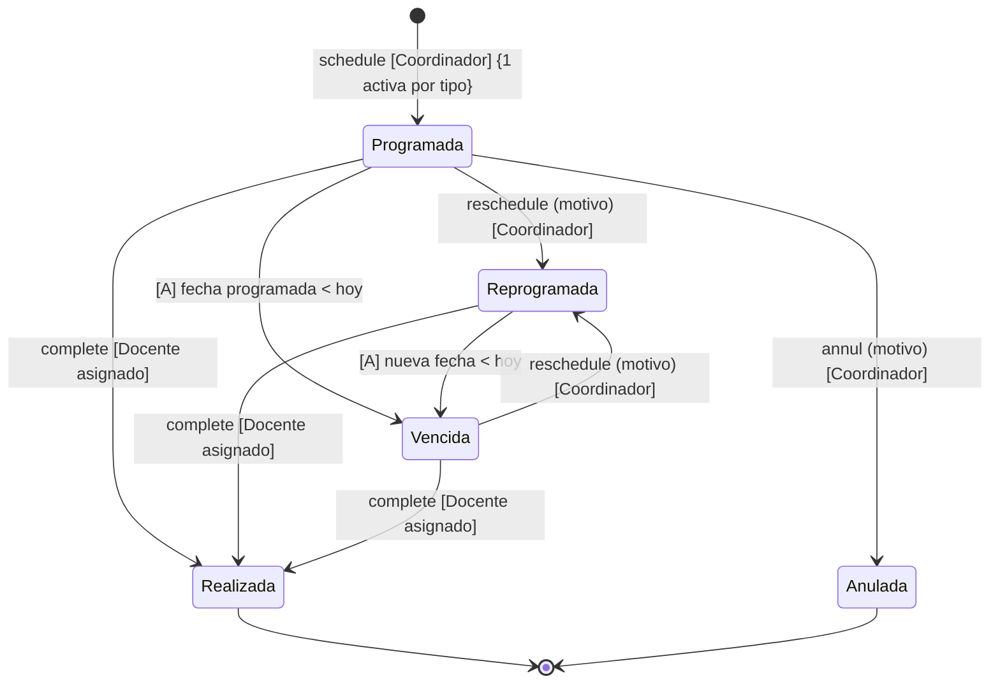
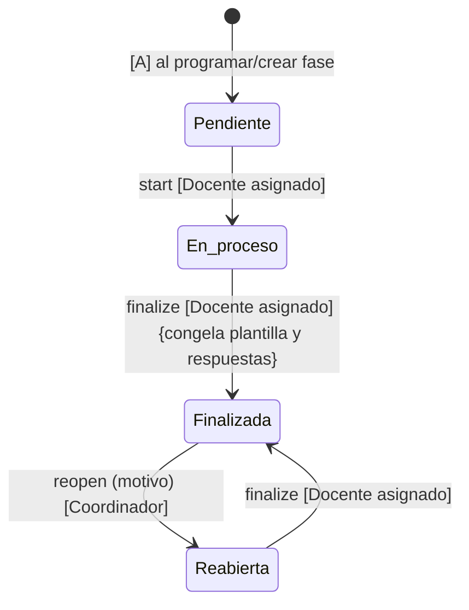
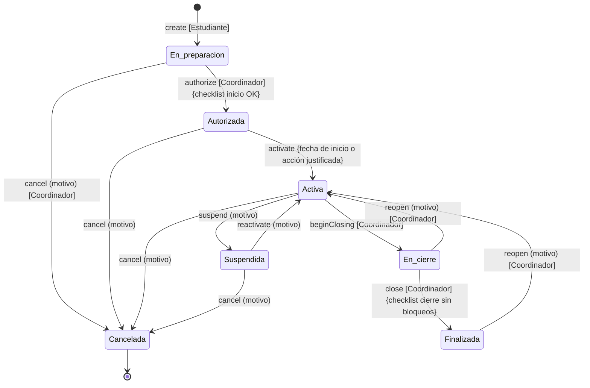
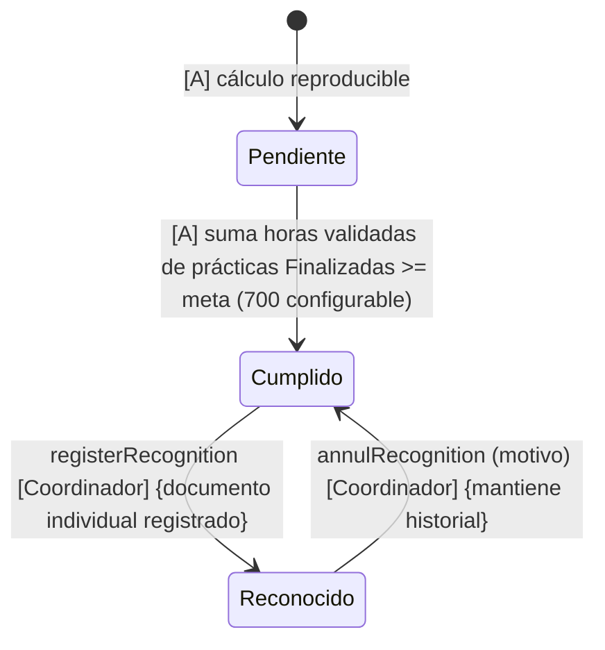

# 03 — Máquinas de estado

> Los estados se modifican **solo mediante acciones explícitas** (`submit`, `observe`, `approve`, `authorize`, `close`, `reopen`, etc.), nunca con PATCH arbitrario de `status`. Cada transición registra actor, fecha, estado anterior y resultado en `AuditEvent`.

Convenciones:
- **[A] = acción del sistema/automática** (derivada, no manual).
- Guardas entre `{ }`; motivo obligatorio indicado como `(motivo)`.
- Transición inválida → `409` con las transiciones permitidas.

## 1. Solicitud de carta (`LetterRequest`)

| Transición | Acción | Actor | Guardas |
|---|---|---|---|
| Borrador → Enviada | `submit` | Estudiante propietario | Perfil completo (HU-02); campos de plantilla completos; idempotente (TK-030). |
| Enviada → Observada | `observe` | Secretaría del campus | Comentario obligatorio (HU-07). |
| Enviada → Aprobada | `approve` | Secretaría del campus | Genera PDF final atómicamente; congela datos (HU-07, TK-026). |
| Enviada/Reenviada → Anulada | `annul` | Secretaría del campus | Motivo obligatorio. |
| Observada → Reenviada | `resubmit` | Estudiante propietario | Crea nueva `LetterRequestRevision`; conserva comentario (HU-08). |

Notas: Aprobada bloquea toda edición; el estudiante nunca sube la carta (RN-03); la numeración final es configuración pendiente (CFG-03); la descarga se audita.

## 2. Documento del expediente (`Document`/`DocumentVersion`)

Estado vigente = estado de la última versión. Cada reenvío crea versión (RN-09).

| Transición | Acción | Actor | Guardas |
|---|---|---|---|
| → Pendiente | `upload` | Estudiante propietario (o docente con evidencia propia) | Validación técnica automática previa: MIME PDF, tamaño configurable, estructura legible (HU-15). |
| Pendiente/Observado → En revisión | `submit` | Estudiante propietario | Reemplazo solo de Pendientes u Observados (HU-14); nueva versión. |
| En revisión → Observado | `observe` | Coordinador del campus | Comentario obligatorio vinculado a la versión revisada (HU-16, HU-17). |
| En revisión → Aprobado | `approve` | Coordinador del campus | Revisión humana; versión inmutable desde entonces (RN-08, RN-09). |
| En revisión → Anulado | `annul` | Coordinador del campus | Motivo obligatorio; conserva historial (HU-16). |

Notas: la validación automática nunca sustituye la revisión humana (RN-08); aprobado no se sobrescribe ni se elimina físicamente (I-13); la carta es caso especial revisado por Secretaría (ver 02).

## 3. Registro de horas (`HourRecord`)

| Transición | Acción | Actor | Guardas |
|---|---|---|---|
| → Borrador | `saveDraft` | Estudiante propietario | Práctica Activa; `0 < horas <= 24`; fecha dentro del rango de la práctica (rechazo con advertencia, A-04). |
| Borrador → Enviado | `submit` | Estudiante propietario | Registro completo (HU-22); bloqueado hasta validar/observar. |
| Enviado → Observado | `observe` | Coordinador del campus | Comentario obligatorio; habilita corrección (HU-23). |
| Enviado → Validado | `validate` | Coordinador del campus | Solo Validado incorpora horas al total (RN-06). |
| Observado → Enviado | `resubmit` | Estudiante propietario | Nueva versión del registro; conserva observación. |

Notas: sin edición directa del coordinador sobre horas del estudiante (HU-23); práctica Suspendida bloquea nuevos envíos (HU-19); los totales son derivados (I-08).

## 4. Supervisión (`Supervision`)

| Transición | Acción | Actor | Guardas |
|---|---|---|---|
| → Programada | `schedule` | Coordinador del campus | Tipo ENTRADA/INTERMEDIA/FINAL; máximo una activa del mismo tipo (HU-25); fecha dentro del periodo de la práctica o advertencia justificada. |
| Programada/Vencida → Reprogramada | `reschedule` | Coordinador del campus | Nueva fecha y motivo; conserva la programación anterior (HU-27). |
| → Realizada | `complete` | Docente asignado | Registro: fecha real, modalidad, observaciones, acuerdos, evidencia opcional (HU-26); el borrador del resultado no altera el estado de la programación. |
| Programada → Anulada | `annul` | Coordinador del campus | Motivo obligatorio. |
| → Vencida | `[A]` | Sistema | Fecha programada < hoy con estado Programada/Reprogramada; derivada, nunca editada (HU-27). |

Notas: reabrir una supervisión realizada no figura en el ciclo base; el reabrir aplica a evaluación docente (HU-26 solo menciona reapertura para evaluación y práctica; si el coordinador necesita reabrir una supervisión, se trata con `complete` + nueva supervisión del mismo tipo tras anular la anterior — documentado como decisión A-06).

## 5. Evaluación docente (`Evaluation`)

| Transición | Acción | Actor | Guardas |
|---|---|---|---|
| → En proceso | `start` | Docente asignado | Crea borrador de respuestas; escala 1–5 con opción NA (HU-28). |
| En proceso → Finalizada | `finalize` | Docente asignado | Respuestas completas; NA excluido del cálculo (HU-28); congela versión de plantilla (HU-31). |
| Finalizada → Reabierta | `reopen` | Coordinador del campus | Motivo obligatorio (HU-28, HU-30). |
| Reabierta → Finalizada | `finalize` | Docente asignado | Nueva finalización con la misma versión de instrumento. |

Notas: sin fórmula combinada con la nota empresarial (HU-30); la versión inicial de plantilla reproduce las fichas actuales por validar (CFG-05).

## 6. Práctica (`Practice`)

| Transición | Acción | Actor | Guardas |
|---|---|---|---|
| → En preparación | `create` | Estudiante propietario | Perfil completo; empresa y datos de práctica; carta aprobada vinculada "cuando corresponda" (HU-11). |
| En preparación → Autorizada | `authorize` | Coordinador del campus | Datos completos y documentos iniciales obligatorios Aprobados (HU-18, I-09). |
| Autorizada → Activa | `activate` | Coordinador del campus | Fecha de inicio alcanzada o acción justificada (HU-18). |
| Activa → Suspendida | `suspend` | Coordinador del campus | Motivo, fecha efectiva y responsable (HU-19). |
| Suspendida → Activa | `reactivate` | Coordinador del campus | Motivo obligatorio. |
| Activa → En cierre | `beginClosing` | Coordinador del campus | Inicia etapa de cierre (HU-34). |
| En cierre → Finalizada | `close` | Coordinador del campus | Checklist de cierre sin bloqueos (HU-34, HU-35); bloquea nuevas horas/documentos ordinarios. |
| En cierre/Activa → Cancelada | `cancel` | Coordinador del campus | Motivo; conserva documentos, horas y evaluaciones (HU-19). |
| Finalizada → Activa | `reopen` | Coordinador del campus | Motivo; habilita correcciones excepcionales (HU-35). |
| En preparación/Autorizada/Activa/Suspendida → Cancelada | `cancel` | Coordinador del campus | Motivo obligatorio. |

Notas: Finalizar una práctica no implica cumplir la meta total (HU-35); el cambio de empresa genera un nuevo expediente, no una edición (HU-19, DEC-04).

## 7. Cumplimiento PPP (derivado por estudiante)

No es una tabla de estados editables: es un **estado derivado** con una sola acción de mutación.

| Regla | Detalle |
|---|---|
| Progreso | Todas las horas **Validadas** (de prácticas activas, suspendidas o en cierre) (HU-24). |
| Cumplimiento | Horas validadas **solo de prácticas Finalizadas** (HU-36, RN-06). |
| Meta | `SystemParameter.PPP_HOURS_TARGET`, inicial **700**, configurable por SYSTEM_ADMIN (CFG-07). |
| Reconocimiento | `registerRecognition` exige estado `Cumplido`; cambia a `Reconocido` (HU-37); uno por estudiante (I-12). |
| Anulación | `annulRecognition` con motivo; revierte a `Cumplido` conservando el historial (matriz 2.8). |

Notas: fronteras 699/700 probadas en testing (TK-144); el estado se recalcula tras cada transición relevante (validación de horas, cierre, reconocimiento).

## 8. Transiciones automáticas e idempotencia

- `Vencida` (supervisión): derivada por fecha; se materializa mediante evaluación perezosa o tarea programada; nunca manual.
- Reintentar `submit`, `resubmit` o `approve` al alcanzar el mismo estado devuelve el recurso ya transicionado; las demás repeticiones inválidas devuelven `409` con transiciones permitidas. `Idempotency-Key` puede acompañar los comandos de envío (TK-030).
- Toda transición persiste en la misma transacción: cambio de estado + `AuditEvent` (I-15, RNF-04).
