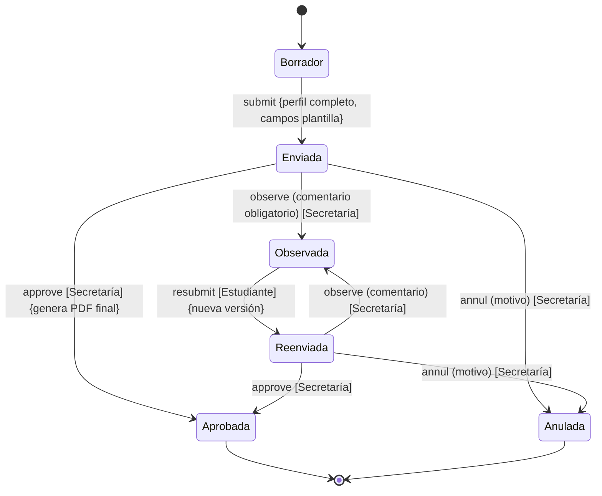
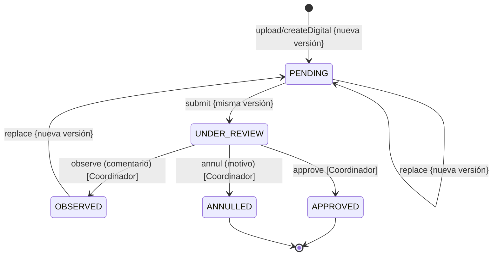
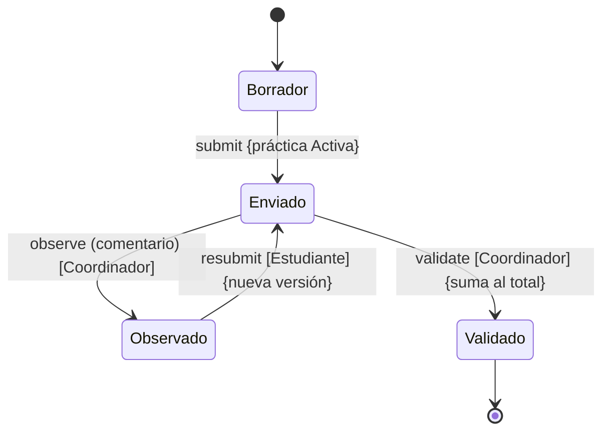
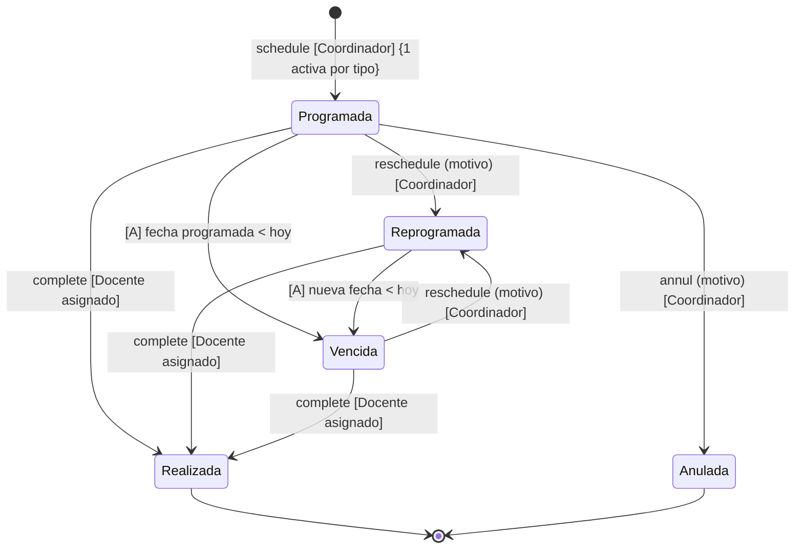
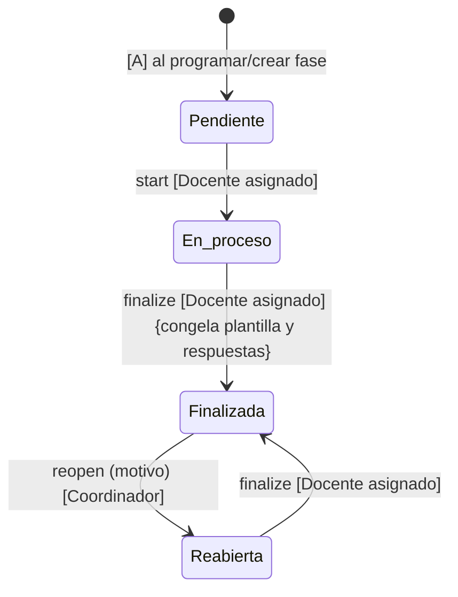
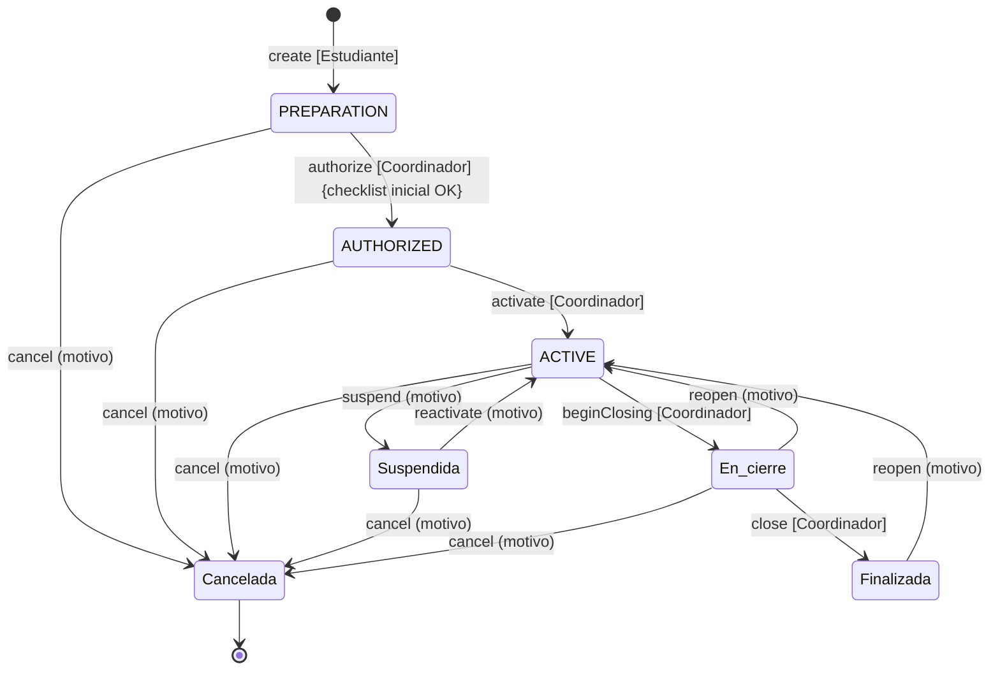
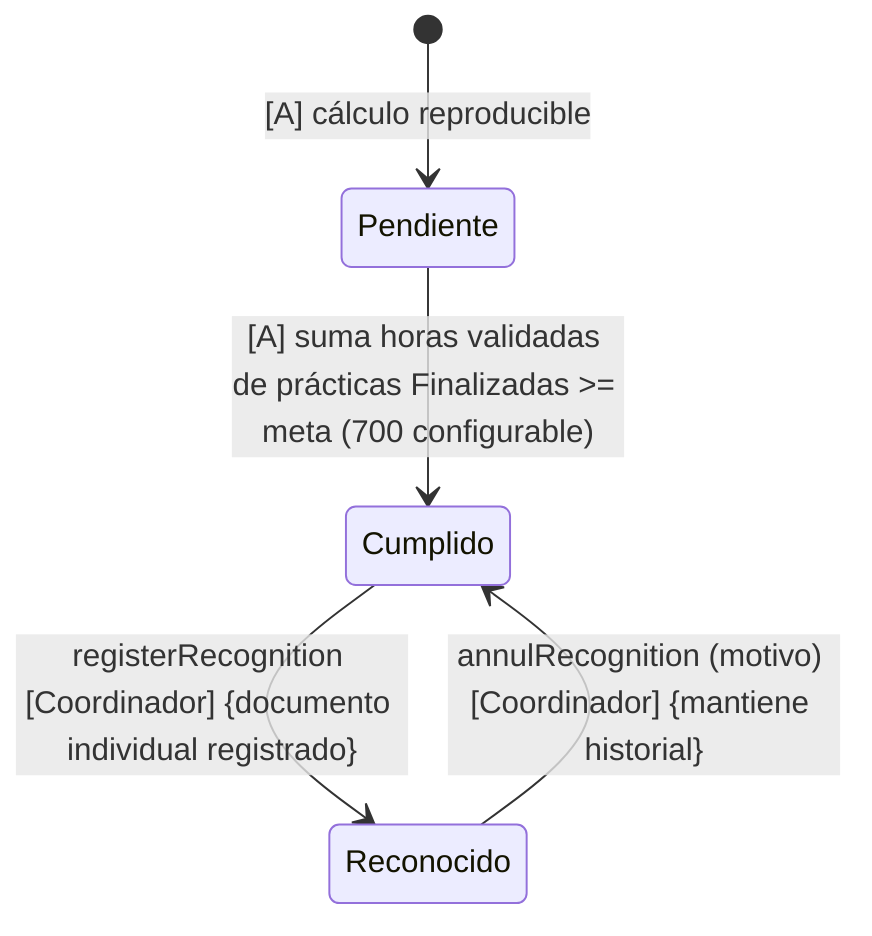

# 03 — Máquinas de estado

> Los estados se modifican **solo mediante acciones explícitas** (`submit`, `observe`, `approve`, `authorize`, `close`, `reopen`, etc.), nunca con PATCH arbitrario de `status`. Cada transición registra actor, fecha, estado anterior y resultado en `AuditEvent`; las transiciones de práctica agregan `PracticeStatusHistory` en la misma transacción.

Convenciones:
- **[A] = acción del sistema/automática** (derivada, no manual).
- Guardas entre `{ }`; motivo obligatorio indicado como `(motivo)`.
- Transición inválida → `409` con las transiciones permitidas.

## 1. Solicitud de carta (`LetterRequest`)

| Transición | Acción | Actor | Guardas |
|---|---|---|---|
| Borrador → Enviada | `submit` | Estudiante propietario | Perfil completo (HU-02); campos de plantilla completos; idempotente (TK-030). |
| Enviada → Observada | `observe` | Secretaría del campus | Comentario obligatorio (HU-07). |
| Enviada → Aprobada | `approve` | Secretaría del campus | Genera PDF final atómicamente; congela datos (HU-07, TK-026). |
| Enviada/Reenviada → Anulada | `annul` | Secretaría del campus | Motivo obligatorio. |
| Observada → Reenviada | `resubmit` | Estudiante propietario | Crea nueva `LetterRequestRevision`; conserva comentario (HU-08). |

Notas: Aprobada bloquea toda edición; el estudiante nunca sube la carta (RN-03); la numeración final es configuración pendiente (CFG-03); la descarga se audita.

## 2. Documento del expediente (`Document`/`DocumentVersion`)

El estado vigente del agregado es el de `currentVersion`. La carga o sustitución crea una versión nueva `PENDING`; `submit` transiciona **esa misma versión**. Cada revisión apunta a la versión actual exacta (RN-09).

| Transición | Acción | Actor | Guardas |
|---|---|---|---|
| → `PENDING` | `upload` / `createDigital` / `replace` | Estudiante propietario | Snapshot y tipo de evidencia coinciden. PDF: extensión `.pdf`, MIME `application/pdf`, magic bytes `%PDF`, no vacío y tamaño máximo configurable. Registro digital: metadata JSON válida. Crea nueva versión y actualiza `Document.currentVersion/status`. |
| `PENDING` → `UNDER_REVIEW` | `submit` | Estudiante propietario | Transiciona la versión actual, sin crear otra. |
| `UNDER_REVIEW` → `OBSERVED` | `observe` | Coordinador del mismo `CampusSchool` | La versión revisada es la actual exacta; comentario obligatorio (HU-16, HU-17). |
| `UNDER_REVIEW` → `APPROVED` | `approve` | Coordinador del mismo `CampusSchool` | Revisión humana; documento y versión quedan inmutables (RN-08, RN-09). |
| `UNDER_REVIEW` → `ANNULLED` | `annul` | Coordinador del mismo `CampusSchool` | Motivo obligatorio; conserva historial (HU-16). |
| `OBSERVED` → `PENDING` | `upload` / `createDigital` | Estudiante propietario | Crea una versión nueva; la versión observada nunca vuelve a enviarse. Después se requiere `submit` para llegar a `UNDER_REVIEW`. |

Notas: el flujo agregado `OBSERVED`→`UNDER_REVIEW` requiere dos acciones: nueva evidencia `PENDING` y posterior `submit`. La validación PDF es solo técnica; no hay OCR ni validación de firma o semántica. No existe ruta de borrado y `APPROVED` es terminal e inmutable (I-13); la carta generada por el sistema mantiene su flujo especial (ver 02).

## 3. Registro de horas (`HourRecord`)

| Transición | Acción | Actor | Guardas |
|---|---|---|---|
| → Borrador | `saveDraft` | Estudiante propietario | Práctica Activa; `0 < horas <= 24`; fecha dentro del rango de la práctica (rechazo con advertencia, A-04). |
| Borrador → Enviado | `submit` | Estudiante propietario | Registro completo (HU-22); bloqueado hasta validar/observar. |
| Enviado → Observado | `observe` | Coordinador del campus | Comentario obligatorio; habilita corrección (HU-23). |
| Enviado → Validado | `validate` | Coordinador del campus | Solo Validado incorpora horas al total (RN-06). |
| Observado → Enviado | `resubmit` | Estudiante propietario | Nueva versión del registro; conserva observación. |

Notas: sin edición directa del coordinador sobre horas del estudiante (HU-23); práctica Suspendida bloquea nuevos envíos (HU-19); los totales son derivados (I-08).

## 4. Supervisión (`Supervision`)

| Transición | Acción | Actor | Guardas |
|---|---|---|---|
| → Programada | `schedule` | Coordinador del campus | Tipo ENTRADA/INTERMEDIA/FINAL; máximo una activa del mismo tipo (HU-25); fecha dentro del periodo de la práctica o advertencia justificada. |
| Programada/Vencida → Reprogramada | `reschedule` | Coordinador del campus | Nueva fecha y motivo; conserva la programación anterior (HU-27). |
| → Realizada | `complete` | Docente asignado | Registro: fecha real, modalidad, observaciones, acuerdos, evidencia opcional (HU-26); el borrador del resultado no altera el estado de la programación. |
| Programada → Anulada | `annul` | Coordinador del campus | Motivo obligatorio. |
| → Vencida | `[A]` | Sistema | Fecha programada < hoy con estado Programada/Reprogramada; derivada, nunca editada (HU-27). |

Notas: reabrir una supervisión realizada no figura en el ciclo base; el reabrir aplica a evaluación docente (HU-26 solo menciona reapertura para evaluación y práctica; si el coordinador necesita reabrir una supervisión, se trata con `complete` + nueva supervisión del mismo tipo tras anular la anterior — documentado como decisión A-06).

## 5. Evaluación docente (`Evaluation`)

| Transición | Acción | Actor | Guardas |
|---|---|---|---|
| → En proceso | `start` | Docente asignado | Crea borrador de respuestas; escala 1–5 con opción NA (HU-28). |
| En proceso → Finalizada | `finalize` | Docente asignado | Respuestas completas; NA excluido del cálculo (HU-28); congela versión de plantilla (HU-31). |
| Finalizada → Reabierta | `reopen` | Coordinador del campus | Motivo obligatorio (HU-28, HU-30). |
| Reabierta → Finalizada | `finalize` | Docente asignado | Nueva finalización con la misma versión de instrumento. |

Notas: sin fórmula combinada con la nota empresarial (HU-30); la versión inicial de plantilla reproduce las fichas actuales por validar (CFG-05).

## 6. Práctica (`Practice`)

Los estados necesarios en la entrega actual son `PREPARATION`, `AUTHORIZED` y `ACTIVE`. Los estados posteriores permanecen planificados para las fases de operación y cierre.

| Transición | Acción | Actor | Guardas |
|---|---|---|---|
| → `PREPARATION` | `create` | Estudiante propietario | Perfil completo; `Company`, `CompanyRepresentative`, `AcademicPeriod` y `CampusSchool` válidos. Captura `representativeSnapshot` y las definiciones `INITIAL` activas; crea sus documentos 1:1. |
| `PREPARATION` → `AUTHORIZED` | `authorize` | Coordinador del mismo `CampusSchool` | Datos completos y todos los snapshots iniciales obligatorios con documentos `APPROVED` (HU-18, I-09). |
| `AUTHORIZED` → `ACTIVE` | `activate` | Coordinador del mismo `CampusSchool` | Todos los snapshots iniciales obligatorios siguen `APPROVED`; fecha de inicio alcanzada o acción justificada (HU-18). |
| `ACTIVE` → Suspendida (futura) | `suspend` | Coordinador del campus | Motivo, fecha efectiva y responsable (HU-19). |
| Suspendida → `ACTIVE` (futura) | `reactivate` | Coordinador del campus | Motivo obligatorio. |
| `ACTIVE` → En cierre (futura) | `beginClosing` | Coordinador del campus | Inicia etapa de cierre (HU-34). |
| En cierre → Finalizada | `close` | Coordinador del campus | Checklist de cierre sin bloqueos (HU-34, HU-35); bloquea nuevas horas/documentos ordinarios. |
| En cierre/`ACTIVE` → Cancelada (futura) | `cancel` | Coordinador del campus | Motivo; conserva documentos, horas y evaluaciones (HU-19). |
| Finalizada → `ACTIVE` (futura) | `reopen` | Coordinador del campus | Motivo; habilita correcciones excepcionales (HU-35). |
| `PREPARATION`/`AUTHORIZED`/`ACTIVE`/Suspendida → Cancelada (futura) | `cancel` | Coordinador del campus | Motivo obligatorio. |

Notas: cada transición escribe `PracticeStatusHistory` y `AuditEvent`, ambos append-only, atómicamente con el estado. Empresa, representante elegido y `representativeSnapshot` no se cambian; una empresa distinta exige un expediente nuevo. Finalizar una práctica no implica cumplir la meta total (HU-35).

## 7. Cumplimiento PPP (derivado por estudiante)

No es una tabla de estados editables: es un **estado derivado** con una sola acción de mutación.

| Regla | Detalle |
|---|---|
| Progreso | Todas las horas **Validadas** (de prácticas activas, suspendidas o en cierre) (HU-24). |
| Cumplimiento | Horas validadas **solo de prácticas Finalizadas** (HU-36, RN-06). |
| Meta | `SystemParameter.PPP_HOURS_TARGET`, inicial **700**, configurable por SYSTEM_ADMIN (CFG-07). |
| Reconocimiento | `registerRecognition` exige estado `Cumplido`; cambia a `Reconocido` (HU-37); uno por estudiante (I-12). |
| Anulación | `annulRecognition` con motivo; revierte a `Cumplido` conservando el historial (matriz 2.8). |

Notas: fronteras 699/700 probadas en testing (TK-144); el estado se recalcula tras cada transición relevante (validación de horas, cierre, reconocimiento).

## 8. Transiciones automáticas e idempotencia

- `Vencida` (supervisión): derivada por fecha; se materializa mediante evaluación perezosa o tarea programada; nunca manual.
- Reintentar `submit`, `resubmit` o `approve` al alcanzar el mismo estado devuelve el recurso ya transicionado; las demás repeticiones inválidas devuelven `409` con transiciones permitidas. `Idempotency-Key` puede acompañar los comandos de envío (TK-030).
- Toda transición persiste en la misma transacción: cambio de estado + `AuditEvent`; para `Practice`, también `PracticeStatusHistory` append-only (I-15, RNF-04).
